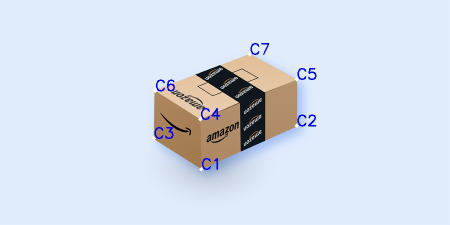

# 2D-to-3D-converter

This project is for my deeper understanding of Projection and Homography.
This is a simple API which takes a 2D image and gives a 3D perspective. 

## #Installation
`pip3 install -r requirements.txt`

## #Overview

* XY plane

  
* YZ plane

* XZ plane

## #Steps to run
`python3 main.py <file name> -r <0,1> #(if you the image doesn't fit in the screen)

